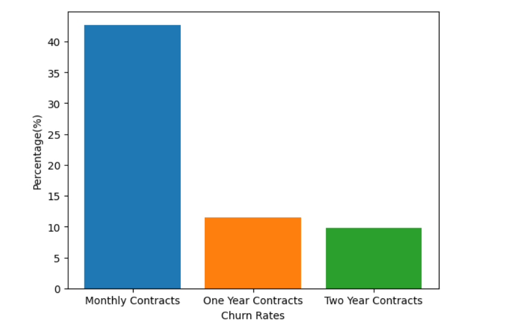
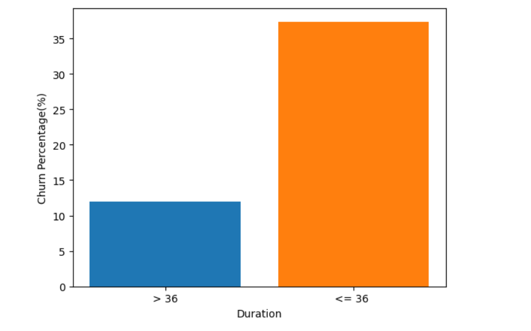
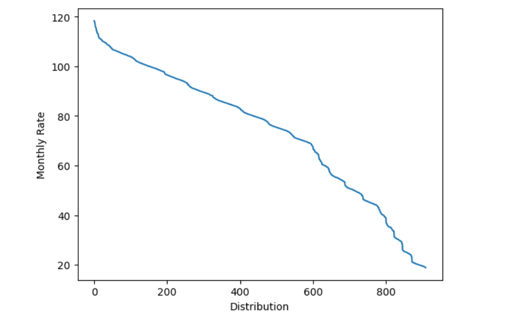

# 📊 Gaurav's Analytics Portfolio

# [ Teleco-Customer-Churn-Dataset-Analysis](https://github.com/gyansu75/Teleco-Customer-Churn-Dataset-Analysis)

This is a project I did for Scriptguru Digital Solutions Pvt. Ltd , where I build a recommendation system for a Telecom Company named TELECO on there Churn Data set.

## 📌 Project Overview
The given dataset is of a Telecom Company named TELECO which consists of data regarding :
- Customers who left within the last month – the column is called Churn
- Services that each customer has signed up for – phone, multiple lines, internet, online security, online backup, device protection, tech support, and streaming TV and movies
- Customer account information – how long they’ve been a customer, contract, payment method, paperless billing, monthly charges, and total charges
- Demographic info about customers – gender, age range, and if they have partners and dependents

---
## Assumptions
1. Customers retention is more when contract is longer
2. Customer tend to leave when tenure was shorter
3. Customer Churn rate was Maximum when the the Contract was for Monthly Basis
4. Expensive Monthly Plans lead to more Churning of Customers. 

---

    

## 🎯 Problem Statement
- Check the Churn Rates for each type of Contract and plot the information in a Bar graph of Analysis
- Check the Variation concentration of Tenure and find out if variation is high or low
- Prepare a graph to compare Churn Rates for Long v/s Short Tenure
- Compare the Montly price and Churn Rates for the given data.
- Give Recommendations Based on Analysis

---

## 📊 Data Identification
**Dataset:** `data3.csv`  
**Key Columns Include:**
- **Tenure** - contains the tenure length
- **Contract** - type of contract
- **Churn** - Customers left or not
- **MonthlyCharges** - monthly charges for the services

---
## Hypothesis

1.Churn rate varies due to the **type of Contract** .
2.Churn rate increases as the Duration of the **Tenure** is longer.
3.Concentration in **variation of the Tenure** is high.
4.Higher Charges lead to Higher Customer Churning.

## 🧹 Data Exploration & Cleaning
### Steps:
1. **Import and Inspect Data**
   - Check dataset shape, column types, and sample records.
2. **Handle Missing Values**
   - Identify and impute or drop missing data appropriately.
3. **Remove Duplicates & Outliers**
   - Eliminate redundant rows and handle only unique values.
4. **Feature Formatting**
   - Make list of unique values, encode categorical variables, and create derived features if necessary.

---

## 🔍 Data Analysis & Insights
### Exploratory Analysis:
- Firstly, the dataset was loaded in the Jupyter notebook and Extracted the data information using the PANDAS Module of Python.
- Then, Data Cleaning and Modelling operations were peformed on the Dataset to Filter out the relevent data required to perform Analysis.
- After that ,  the relevant data was visualized using the Matplotlib Module of Python to gain deep insights on the given problem statement.
- Multiple EDA explorations were performed to Analyse the Visualizations and Dataset.
- Finally , There were some key findings and relevant recommendations were made using the insights.

### Visualizations:
- Bar plots
- Line Charts
- Trend lines for Variations.

---

## 📈 Key Findings

1. The Bar graph shows the Churn rates were higher for the short-term contracts. EG. Month_to_month type Had the highest Churn rates

2. This shows the variation in the Tenure for the usage of the services provided by Teleco. It clearly shows the tenure had a wide range of Customer Coverage 

3. The graph shows that, for the Tenure which were greater than 36 (mean value of the Tenure Column) show less Customer Churn rate than for the Tenure of < = 36.  

3. The line graph shows that, Higher Service Charges led to increase in Customer Churning.
---

## 🧠 Conclusion & Recommendations
1. Teleco should focus on the increasing the duration of Contract to retain maximum customers.
2. Company Should provide some extra offers to attract customers and prevent churning for Customers under short-term contracts
3. Company should focus on the pricing structure for the services and provide addtional services for retaining customers for the high price service category.
4. Company should update its service Quality to constantly meet the Demands of Existing and potential customers.

## 💻 Tools & Libraries
- Python (Pandas, Matplotlib)
- Jupyter Notebook
  
---

## ✍️ Author
**Gaurav Gyansu**  
*Data Analytics Portfolio Project*  
📧 [Email](gyansu75@gmail.com) | 🔗 [LinkedIn](www.linkedin.com/in/gaurav-gyansu-66b1121b9)

---

